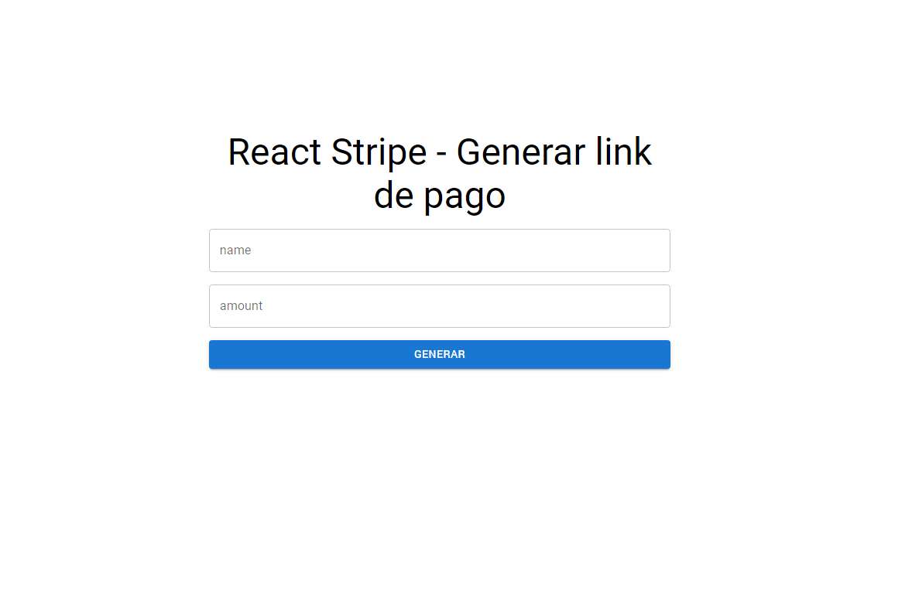
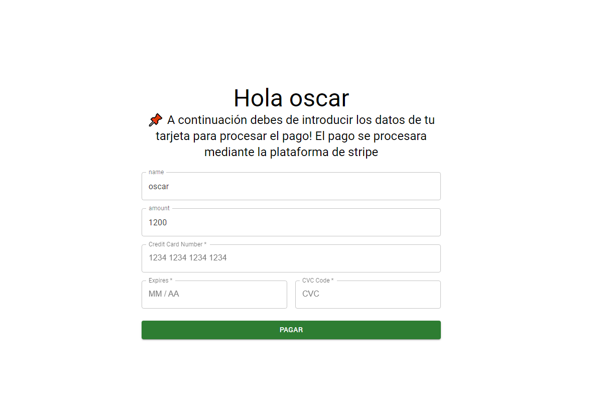

# React Stripe Material UI
Uso de [Stripe](https://stripe.com/) con React ,material UI y node para la parte del backend.  

- Generamos el link de pago con el nombre y monto :



- Procedemos a llenar el formulario con la tarjeta de credito



- si todo salio bien nos redirigiráS a la pagina success


### Built With 🛠️


* [React.js](https://es.reactjs.org/)
* [Material UI](https://mui.com/)
* [Stripe](https://stripe.com/)
* [Node.js](https://nodejs.org/es/)

## Live demo 🔴

Sitio Web - [Stripe React Material UI](https://react-stripe-materialui.netlify.app/).


## Getting Started 🚀

This is an example of how you may give instructions on setting up your project locally.
To get a local copy up and running follow these simple example steps.

### Installation

1. Clone the repo
   ```sh
   git clone https://github.com/DiegoRodriguez-sc/react-stripe.git
   ```
2. Install NPM packages
   ```sh
   npm install
   ```


## Contact ☎️

 * [Linkedin](www.linkedin.com/in/diego-rodriguez-sc)

* Project Link: [https://github.com/DiegoRodriguez-sc/react-stripe](https://github.com/DiegoRodriguez-sc/react-stripe)